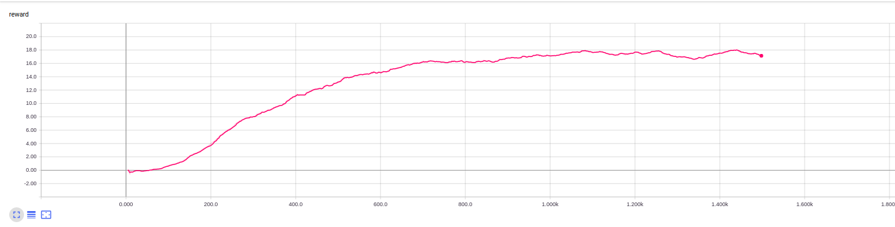

# Report

## Algorithm

Classical DQN is used as described here: https://www.cs.toronto.edu/~vmnih/docs/dqn.pdf
The single derivation is the use of a target network as described
here https://arxiv.org/pdf/1509.06461.pdf (3).

DDQN was evaluated but resulted in slighly decreased reward.

### Hyperparameters

Replay buffer size: 10000
Minibatch size: 1024
Discount factor: 0.99
Soft update of target parameters: 1e-3
Learning rate: 5e-5
Number of network updates: 4

### Network

A three layer MLP was used with hidden layer size of two times 64 neurons.
Larger or deeper MLPs lead to worse results.

## Results 

A maximum reward per 100 episodes of 17.84 after 1200 episodes was reached.

## Future work

If the banana environment would be properly documented the network could
be tailored to the specific inputs like using convolutional layers
for spacial connected inputs.

It would also be interesting if TRPO or PPO would perform better. 

